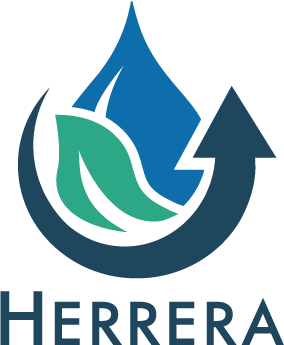

# Thurston County Water Quality Dashboard

------------------------------------------------------------------------

# Project 23-08082-000

## Description

This dashboard presents water quality monitoring data for Thurston
County Streams.

Access the dashboard here:
<https://herrerainc.shinyapps.io/ThurstonWQDashboard_Streams_Dev/>

## 📦 Requirements and Dependencies

This Shiny application is hosted on shinyapps.io. Should you need to run
the app locally, please see the deps.yaml file in this directory for a
complete list of dependencies. The install_deps.R script will
automatically install the necessary packages.

You will need to have R and a compatible IDE (e.g., RStudio or Positron)
installed on your computer.

## :droplet: Data

The original, unmodified data used in this project is located in the
inputs/ subdirectory, which is backed up both on this GitHub and in
Herrera's private
[SharePoint](https://herrerainc.sharepoint.com/teams/m-24-08458-000/Internal/Forms/AllItems.aspx?id=%2Fteams%2Fm%2D24%2D08458%2D000%2FInternal%2FProject%2DFiles%2FDashboard%5Fraw%5Fdata&viewid=5a5b1715%2D8cc2%2D40c8%2Da461%2D5a736f61a7ff).

If you do not have access to the data, please contact the contributors
listed at the bottom of the repository.

### :arrows_counterclockwise: Layout of directory and data

The ui.R and server.R scripts contain the application code.

**General flow of data acquisition + tidying:**

The inputs/ folder contains internal and external data used in the app.
The sourcing_scripts/ folder contains the scripts that will pull in
external data, tidy it, and produce the data used in the app.

-   WQP_r_script.R sources data from the remote [Water Quality
    Portal](https://www.waterqualitydata.us.) and tidies the sourced
    data to match with internal formatting. This tidied dataframe is
    saved as wqp_data.csv and is used to produce the various dashboard
    tables.

-   The data_prep.R script produces multiple RDS files that are used
    within the dashboard.

Internal, raw data consists of the following files located in the
inputs/ subdirectory:

-   "Herrera All Stream Data Dump 4 12 2023.csv"

    -   This file has two uses:
        1.  It is used to generate a table of SITE_CODE, SITE_NAME, LAT,
            and LON, which is used for mapping.
        2.  It is used as the source of water quality data for plotting,
            calculating WQI and comparing to water quality criteria.
    -   It contains the following column structure:

| Field         | Description                                                                                                                                                                                                                      |
|--------------------------|----------------------------------------------|
| **date_time** | `MM/DD/YY HH:MM` in local time (assumed to be text value)                                                                                                                                                                        |
| **SITE_CODE** | Text value designating the site – note that the SITE_CODE names on WQX appear to be slightly different, often having a prefix                                                                                                    |
| **SITE_NAME** | Long-form site name                                                                                                                                                                                                              |
| **Metro_ID**  | Read, but not used                                                                                                                                                                                                               |
| **LAT**       | Site location latitude, numeric                                                                                                                                                                                                  |
| **LON**       | Site location longitude, numeric                                                                                                                                                                                                 |
| **parameter** | Parameter (character). Dashboard was developed for **19 distinct parameter names** (e.g., Temperature, Dissolved Oxygen, pH, Turbidity, etc.). Deviation from these names may result in errors in WI and water quality criteria. |
| **value**     | Numeric result for specific parameter                                                                                                                                                                                            |
| **unit**      | Text value for result units (e.g., `mg/L`)                                                                                                                                                                                       |
| **depth_m**   | Numeric value of sampling depth, typically `NA` for streams                                                                                                                                                                      |
| **dup**       | TRUE/FALSE (1/0) value for whether sample is a field duplicate                                                                                                                                                                   |
| **mdl**       | Numeric value of laboratory method detection limit                                                                                                                                                                               |
| **pql**       | Numeric value of laboratory practical quantitation limit (or reporting limit)                                                                                                                                                    |
| **qualifier** | Text value for laboratory qualifiers – `"U"` flags are used to designate non-detects (i.e., \<MDL)                                                                                                                               |

-   "Stream Use Designations Herrera.xlsx"

    -   This file is used to establish the aquatic life use designation
        for Stream Sites. This is used as a look-up table based on
        SITE_CODE.
    -   The file is used for calculating site-specific WQI and comparing
        to relevant water quality criteria.

### :signal_strength: How to Update the Shiny Dashboard Data

1.  Append or replace "Herrera All Stream Data Dump 4 12 2023.csv" with
    updated data. Please note the layout described above.
2.  If additional sites are added, modify the "Stream Use Designations
    Herrera.xlsx" with relevant information
3.  Run "deploy_app.R"

### :exclamation: Helpful Notes

WQP (Water Quality Portal) = NWIS (National Water Information System) +
WQX (WaterQuality Exchange)

For many years we reported “Phosphorous” but now we report “Total
Phosphorus, mixed forms” (method SM4500P-F). The phosphorus query merges
these two into a shorthand field called TP_P.

**Phosphorus data trace**: The two forms of phosphorus initially pulled
into wqp_data.csv are: "Total Phosphorus, mixed forms" and "Phosphorus".
There are no other observations with case-insensitive "phosphorus"
detected in the initial pull.

In data_prep.R the following forms of phosphorus that are detected
within wqp_data.csv are **grouped together as "Total Phosphorus".**

c("Total Phosphorus, mixed forms",'Phosphorus','Total Phosphorus')

*This step appears to incorporate the client's request that the two
previous methods are grouped together as "Total Phosphorus". The only
way phosphorus data could be missing is if phosphorus is defined within
the initial call as something other than the above list. However, the
raw data returned from the call to WQP (wqp_data.csv) does not contain
any other references to the word "phosphorus", case-insensitive, outside
of "Total Phosphorus, mixed forms", and "Phosphorus".*

**Where TP_P comes in:** In the wqi_function.R (reference stop error on
line 48), parameters are referred to as short names. This is where the
TP_P comes in. The wqi_calc will only consider TP_P, which derives from
"Total Phosphorus." As "Total Phosphorus" contains all previous
references to phosphorus, this should contain all observations.

The wqi_function.R calculation applies the function to the tidied
wqp_data.csv. On line 115 in data_prep.R, TP_P is assigned to Total
Phosphorus, which contains all phosphorus references.

All other references throughout the app are for Total Phosphous.

------------------------------------------------------------------------

## 🔧 Pull Requests {#pull-requests}

Pull requests are welcome. Do not merge to the main branch without an
approved code review. For major changes, please open an issue first.

## 💬 Contributors + Contact Information

| Role            | Name                                                                         | GitHub                                   | Website |
|------------------|-------------------|------------------|------------------|
| Primary Contact | [Tim Clark](https://www.herrerainc.com/team-member/tim-clark/)               | [GitHub](https://github.com/clarkbar88)  |         |
| Contributor     | [Regina Lionheart](https://www.herrerainc.com/team-member/regina-lionheart/) | [GitHub](https://github.com/R-Lionheart) |         |
| Contributor     | [Nikki VandePutte](https://www.herrerainc.com/team-member/nikki-vandeputte/) | [GitHub](https://github.com/nvandeputte) |         |